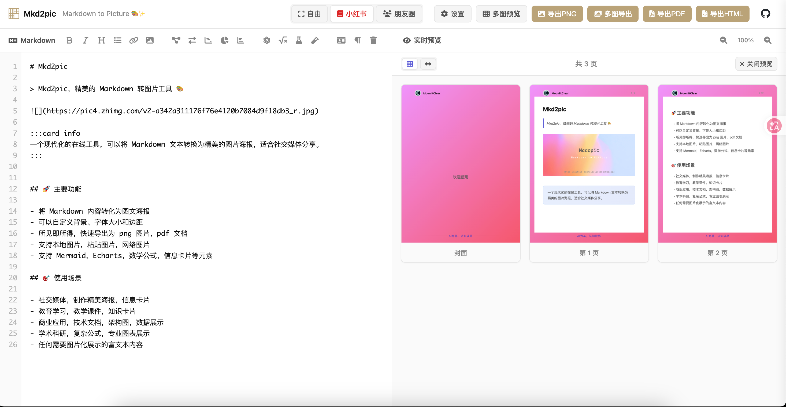

# Madopic

> Madopic (Markdown to Picture) — 精美的 Markdown 转图片工具 ✨



一个现代化的在线工具，将 Markdown 文本转换为精美的图片海报，特别适合社交媒体分享。纯前端实现，零后端依赖，开箱即用。

## ✨ 功能亮点

### 📝 Markdown 渲染
- **实时预览**：左侧编辑、右侧即时渲染，所见即所得
- **丰富语法**：标题、列表、链接、图片、表格、引用、代码块等完整 Markdown 语法支持
- **信息卡片**：`:::card info/success/warning/error` 语法，生成带样式的信息卡片
- **代码高亮**：集成 Prism.js，自动识别语言并语法高亮（暗色主题）

### 🧮 数学公式 & 图表
- **KaTeX 公式**：支持行内 `$E=mc^{2}$` 和块级 `$$\int_a^b f(x)dx$$` 数学公式
- **化学公式**：mhchem 扩展，支持化学反应方程式
- **Mermaid 图表**：流程图、序列图、甘特图、饼图等
- **ECharts 可视化**：柱状图、折线图、饼图等数据可视化
- **模板库**：内置数学、物理、化学公式和图表模板，工具栏一键插入

### 📑 多图预览 & 导出
- **智能分页**：长内容自动按 3:4 比例分割为多页，保证代码块、图表、卡片的完整性
- **网格视图**：以缩略图网格形式浏览所有页面
- **轮播视图**：左右翻页 + 底部缩略图导航
- **多图导出 ZIP**：一键将所有页面导出为 PNG 并打包为 ZIP 下载
- **页码显示**：多页导出自动标注 "X / Y" 页码，颜色可自定义

### 🎨 外观定制
- **三种导出模式**：自由尺寸 / 小红书 3:4 / 朋友圈长图
- **三种背景类型**：
  - 渐变色：8 款预设 + 自定义双色渐变 + 6 种渐变方向
  - 纯色：颜色选择器
  - 背景图：上传图片 + 虚化程度（0~30px）+ 透明度调节
- **页眉设置**：自定义头像、显示名称、名称颜色、上下间距、开关控制
- **页脚设置**：自定义文字、颜色、大小、字间距、分隔线样式、开关控制
- **布局调节**：整体宽度（480~800px）、卡片边距（20~60px）、字体大小（14~22px）

### 📤 多格式导出
- **PNG 导出**：高清位图，适合社交媒体分享
- **多图导出**：智能分割 + ZIP 打包下载
- **PDF 导出**：矢量格式，适合打印和存档
- **HTML 导出**：完整网页，保留所有样式和交互

### 🛠 编辑体验
- **撤销/重做**：Ctrl+Z / Ctrl+Y，最多 50 步历史
- **拖拽图片**：将图片直接拖入编辑器即可插入
- **剪贴板粘贴**：Ctrl+V 粘贴图片，自动 Base64 编码
- **草稿自动保存**：内容和设置自动保存到 localStorage，刷新不丢失
- **丰富工具栏**：粗体、斜体、标题、列表、链接、图片、公式、图表等快捷按钮
- **预览缩放**：50%~150% 灵活调节，触屏支持双指缩放（25%~200%）
- **移动端适配**：响应式布局 + 汉堡菜单，手机平板均可使用
- **键盘快捷键**：常用操作一键触达

## 🎯 使用场景

| 场景 | 用途 |
|------|------|
| **社交媒体** | 小红书图文、朋友圈长图、知识卡片、技术博客配图 |
| **教育学习** | 教学课件、数学/物理/化学公式展示、思维导图、学习笔记 |
| **商业应用** | 技术文档、API 说明、架构图、项目报告、数据展示 |
| **学术科研** | 学术海报、论文图表、数据可视化、研究报告 |

## 🚀 快速开始

### 在线使用

访问在线版即可直接使用，无需安装。

### 本地部署

#### 方法一：直接打开

纯前端项目，双击 `index.html` 即可在浏览器中打开。

#### 方法二：本地 HTTP 服务器（推荐）

```bash
# 克隆项目
git clone https://github.com/zzyong24/mkd2pic.git
cd mkd2pic

# 使用 Python 启动
python -m http.server 8080

# 或使用 Node.js
npx http-server -p 8080

# 或使用 live-server（带热重载）
npx live-server --port=8080
```

访问 `http://localhost:8080` 即可。

#### 方法三：VS Code

安装 "Live Server" 扩展，右键 `index.html` → "Open with Live Server"。

## 🏗 技术栈

| 分类 | 技术 |
|------|------|
| **Markdown 解析** | marked.js |
| **代码高亮** | Prism.js 1.29.0 + Autoloader |
| **数学公式** | KaTeX 0.16.8 + mhchem |
| **流程图** | Mermaid.js 10.6.1 |
| **数据可视化** | Apache ECharts 5.4.3 |
| **图片生成** | html2canvas 1.4.1（CDN 懒加载） |
| **PDF 生成** | jsPDF 2.5.1（CDN 懒加载） |
| **ZIP 打包** | JSZip 3.10.1 |
| **图标** | Font Awesome 6.0.0 |
| **UI 风格** | Notion/Linear 极简设计 |

## 📁 项目结构

```
madopic/
├── index.html          # 主页面
├── style.css           # 样式（Notion/Linear 极简风格）
├── script.js           # 核心逻辑（渲染、分页、导出、设置）
├── favicon.svg         # 网站图标
├── manifest.json       # PWA 配置
├── Portrait.png        # 默认头像
└── README.md           # 项目说明
```

## ⚙️ 核心技术实现

### 智能分页算法
- 将 Markdown 拆分为原子块（标题、段落、代码块、图表、卡片）
- 离屏容器实际测量渲染高度，确保分页精确
- 保证 Mermaid/ECharts/代码块/卡片完整性，不会被拆断

### 渲染管线
- 独立导出 DOM：导出时创建隔离节点，避免影响预览
- 异步串行渲染：数学公式 → Mermaid 图表 → ECharts → 代码高亮
- ID 冲突解决：为导出节点的 Mermaid 图表生成唯一 ID

### 性能优化
- html2canvas / jsPDF CDN 懒加载，不阻塞首屏
- 多图预览 800ms 防抖 + 并发锁，避免频繁渲染
- 图片缓存管理器，最多缓存 50 张，自动清理过期缓存
- 导出时自动裁剪透明边缘

## 📋 更新日志

### 20260324
- **多图预览系统**：网格视图 + 轮播视图，长内容智能分页预览
- **多图导出 ZIP**：一键将所有页面导出为 PNG 并打包下载
- **页眉/页脚配置**：头像、名称、页码、页脚文字、分隔线全面可自定义
- **三种背景类型**：渐变色 / 纯色 / 背景图（含虚化和透明度）
- **设置侧边栏**：4 标签页（页眉、页脚、背景、布局），实时预览
- **代码语法高亮**：集成 Prism.js，自动识别语言
- **撤销/重做**：Ctrl+Z / Ctrl+Y，50 步历史
- **拖拽图片**：直接拖入编辑器插入图片
- **草稿自动保存**：内容和设置持久化到 localStorage
- **整体宽度可调**：480~800px 范围调节
- **触屏双指缩放**：移动端支持 25%~200% 缩放
- **移动端汉堡菜单**：响应式工具栏折叠
- **UI 全面重构**：Notion/Linear 极简设计风格
- **修复分页裁切**：修正分页高度和宽度计算偏差，解决底部文字被截断问题

### 20250906
- 增加导出 HTML
- 已知 bug 修复

### 20250824
- UI 调整
- 增加卡片信息

### 20250814
- **数学公式渲染**：集成 KaTeX 引擎，支持 LaTeX 数学公式
- **化学公式支持**：添加 mhchem 扩展
- **图表绘制系统**：集成 Mermaid，支持流程图、序列图、甘特图等
- **数据可视化**：集成 ECharts
- **PDF 导出功能**：新增矢量格式导出
- **丰富模板库**：内置数学、物理、化学公式和图表模板
- **扩展工具栏**：新增 12 个专业功能按钮

### 20250801
- 渲染性能优化
- 错误处理完善
- 代码结构模块化重构

## 📄 开源协议

本项目采用 [MIT](LICENSE) 协议开源。

---

**Madopic** — 让你的文字更有画面感 🎨✨
