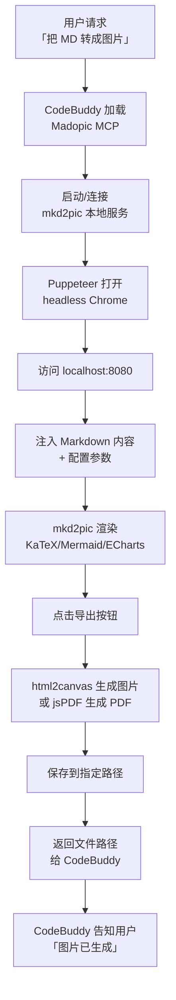

# 🎨 Madopic MCP 服务 — Markdown 转图片的 AI 能力封装

> 把 mkd2pic 工程封装为 MCP 服务，让 CodeBuddy 可以通过自然语言调用"把 Markdown 转成图片"的能力。

---

## 🧭 设计理念

### 为什么要封装成 MCP 服务？

mkd2pic 是一个纯前端的 Markdown 转图片工具，功能强大（支持 KaTeX、Mermaid、ECharts 等），但：

- **前端工具的局限**：需要手动打开浏览器、操作界面、点击导出
- **AI 协作的断层**：CodeBuddy 无法直接调用这个能力来辅助用户工作流

**MCP 服务封装的价值：**

```
用户： "把这份技术文档转成小红书配图"

CodeBuddy（加载 Madopic MCP）：
  ↓
  1. 读取 Markdown 文件
  2. 调用 md2pic 工具，自动：
     - 启动 mkd2pic 本地服务
     - 注入 Markdown 内容
     - 配置合适的格式（xhs 小红书模式）
     - 导出图片到指定位置
  ↓
  → 返回图片路径给用户
```

### 架构设计

```
┌─────────────────────────────────────────────────────────────┐
│  CodeBuddy                                                   │
│    │                                                          │
│    │  "把 README.md 转成小红书配图"                            │
│    ▼                                                          │
│  MCP Client ────────────────────────────────────────────────│
│    │  (stdio / HTTP)                                          │
│    ▼                                                          │
│  ┌─────────────────────────────────────────────────────────┐ │
│  │  Madopic MCP Server (Node.js + TypeScript)               │ │
│  │                                                            │ │
│  │  ┌─────────────────────────────────────────────────────┐  │ │
│  │  │  BrowserManager (Puppeteer)                         │  │ │
│  │  │    │                                               │  │ │
│  │  │    ├── 启动 headless Chrome                        │  │ │
│  │  │    ├── 访问 localhost:8080 (mkd2pic)               │  │ │
│  │  │    ├── 注入 Markdown 内容                          │  │ │
│  │  │    ├── 配置导出参数（格式/背景/封面等）               │  │ │
│  │  │    ├── 触发导出按钮                                 │  │ │
│  │  │    └── 保存图片到指定路径                           │  │ │
│  │  └─────────────────────────────────────────────────────┘  │ │
│  │                                                            │ │
│  │  预设配置 (madopic_config.json)                           │ │
│  └─────────────────────────────────────────────────────────┘ │
└─────────────────────────────────────────────────────────────┘
```

---

## 📁 目录结构

```
mkd2pic/
├── index.html              # mkd2pic 主页面（需 HTTP 服务托管）
├── style.css
├── script.js
├── mcp/                    # ⭐ MCP 服务
│   ├── package.json
│   ├── tsconfig.json
│   ├── madopic_config.json  # 预设样式配置
│   └── src/
│       ├── index.ts         # MCP 服务入口（stdio 通信）
│       ├── browser.ts       # Puppeteer 浏览器控制
│       └── config.ts        # 配置管理
└── ...
```

---

## 🚀 快速开始

### 前提条件

1. **mkd2pic 本地服务运行中**
   ```bash
   cd /path/to/mkd2pic
   python -m http.server 8080
   # 或
   npx http-server -p 8080
   ```

2. **Node.js >= 18**

3. **安装 MCP 服务依赖**
   ```bash
   cd mcp
   npm install
   ```

### 启动 MCP 服务

```bash
# 开发模式（热重载）
npm run dev

# 生产模式
npm run build
npm start
```

### 在 CodeBuddy 中配置

在 CodeBuddy 的 MCP 设置中添加：

```json
{
  "mcpServers": {
    "madopic": {
      "command": "node",
      "args": ["/path/to/mkd2pic/mcp/dist/index.js"],
      "env": {}
    }
  }
}
```

---

## 🛠️ 工具接口

### `md2pic` — 直接转换 Markdown

**参数：**

| 参数 | 类型 | 必填 | 说明 |
|------|------|------|------|
| `markdown` | string | ✅ | 要转换的 Markdown 内容 |
| `output_path` | string | 否 | 输出文件路径，默认 `~/Downloads/mkd2pic-exports/` |
| `format` | enum | 否 | `xhs`（小红书 3:4）\| `pyq`（朋友圈 9:16）\| `free`（自由），默认 `xhs` |
| `mode` | enum | 否 | `single`（单图）\| `multi`（多图+ZIP）\| `pdf`，默认 `multi` |
| `cover_title` | string | 否 | 封面主标题 |
| `cover_subtitle` | string | 否 | 封面副标题 |
| `background` | object | 否 | 背景配置（见下方） |
| `header` | object | 否 | 页眉配置 |
| `footer` | object | 否 | 页脚配置 |
| `layout` | object | 否 | 布局配置 |

**背景配置：**
```typescript
{
  type: "gradient" | "solid" | "image",
  preset: "gradient1" ~ "gradient8" | "custom",
  customStartColor: "#667eea",
  customEndColor: "#764ba2",
  gradientDirection: "135deg"
}
```

**调用示例：**

```
把以下内容转成小红书配图：

# Python 异步编程指南

## 什么是异步？

异步编程允许程序在等待 I/O 时做其他事情...

---

CodeBuddy 执行：

md2pic({
  markdown: "# Python 异步编程指南\n\n## 什么是异步？\n\n异步编程允许...",
  format: "xhs",
  mode: "multi",
  cover_title: "Python 异步编程",
  cover_subtitle: "5 分钟入门 async/await",
  background: { preset: "gradient3" }
})
```

### `md2pic_file` — 转换文件

**参数：**

| 参数 | 类型 | 必填 | 说明 |
|------|------|------|------|
| `file_path` | string | ✅ | Markdown 文件路径 |
| `output_path` | string | 否 | 输出文件路径 |
| `format` | enum | 否 | 导出格式 |
| `mode` | enum | 否 | 导出模式 |

**调用示例：**

```
把 README.md 转成长图

→ md2pic_file({ file_path: "README.md", mode: "single" })
```

### `md2pic_preview` — 预览渲染

生成预览但不导出，用于调试布局。

```
预览一下这个 Markdown 的渲染效果

→ md2pic_preview({
    markdown: "...",
    format: "xhs"
  })
→ 返回预览页面 URL
```

---

## ⚙️ 预设配置

`madopic_config.json` 定义了默认样式，可按需修改：

```json
{
  "output": {
    "default_dir": "~/Downloads/mkd2pic-exports"
  },
  "export": {
    "default_format": "xhs",
    "default_mode": "multi"
  },
  "cover": {
    "enabled": true,
    "titleFontSize": 55,
    "fontFamily": "hei",
    "textEffect": "none",
    "layout": "center"
  },
  "background": {
    "type": "gradient",
    "preset": "gradient3"
  },
  "layout": {
    "fontSize": 14,
    "width": 640,
    "padding": 20
  }
}
```

---

## 🔧 常见使用场景

### 场景 1：技术博客配图

```
把这段 Python 教程转成朋友圈长图，带代码高亮

→ md2pic_file({
    file_path: "python-tutorial.md",
    format: "pyq",
    mode: "multi",
    background: { preset: "gradient7" }
  })
```

### 场景 2：小红书图文

```
生成一张小红书封面图，标题是「AI 时代的编程思维」

→ md2pic({
    markdown: "# AI 时代的编程思维\n\n内容...",
    format: "xhs",
    mode: "single",
    cover_title: "AI 时代的编程思维",
    cover_subtitle: "从写代码到写提示词",
    background: { type: "gradient", preset: "gradient1" }
  })
```

### 场景 3：多图导出 ZIP

```
这份 API 文档导出为多张图片，打包成 ZIP

→ md2pic_file({
    file_path: "api-doc.md",
    format: "xhs",
    mode: "multi",
    output_path: "~/Desktop/api-doc.zip"
  })
```

---

## 📝 技术备忘

### Puppeteer 浏览器管理

- headless 模式启动，无 GUI
- 复用浏览器实例，避免频繁启动开销
- 导出通过点击按钮触发，依赖 mkd2pic 内置的 html2canvas/jsPDF

### 预设配置优先级

```
用户调用参数 > madopic_config.json > 内置默认值
```

### 已知限制

1. **必须运行 mkd2pic HTTP 服务**：MCP 服务本身不包含前端页面
2. **下载路径依赖浏览器下载**：Puppeteer 触发下载后从 Downloads 目录移动到目标路径
3. **渲染等待**：复杂 Markdown（大量公式/图表）需适当延长等待时间

---

## 🔄 完整工作流



---

## 🗂️ 相关资源

| 资源 | 路径 |
|------|------|
| mkd2pic 主项目 | `/Users/zyongzhu/Workbase/mkd2pic/` |
| MCP 服务代码 | `mcp/src/` |
| 预设配置文件 | `mcp/madopic_config.json` |
| 在线体验 | `http://localhost:8080` |
